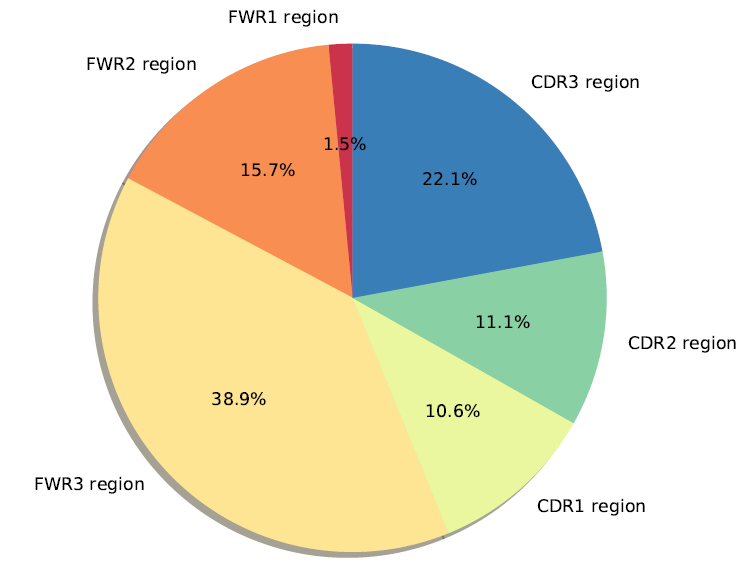
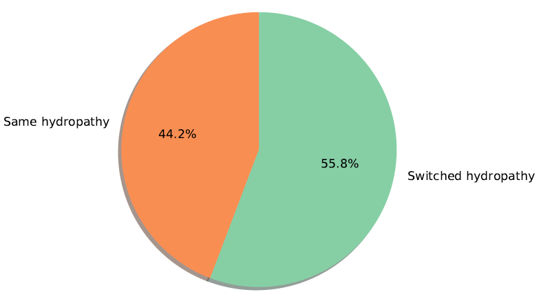

# IgTreeZ
A toolkit for immunoglobulin gene lineage tree analysis.    
Hadas Neuman and Ramit Mehr

## Description
IgTreeZ is a comprehensive analysis tool for Immunoglobulin lineage trees.


## Prerequisites

To run IgTreeZ, you will need these Python3 and the Python packages NumPy, pandas, ETE3, and matplotlib

To use the 'draw' sub-program, you will need [Graphviz](https://graphviz.org/download/) version 2.30.1 or higher

## Installation

1. Clone the repo
   ```sh
   git clone https://github.com/neumanh/IgTreeZ.git
   ```
2. Download [IgTreeZ_1.8.2.tar.gz](./IgTreeZ_1.8.2.tar.gz). To extract the file in the local directory, use
   ```sh
   tar -zxvf IgTreeZ*.tar.gz
   ```
3. Download [IgTreeZ_1.8.2.zip](./IgTreeZ_1.8.2.zip). To extract the file in the local directory, use
   ```sh
   unzip IgTreeZ*.zip
   ```

## Usage

IgTreeZ program includes 5 sub-programs:
* mutations
* poptree
* mtree
* filter
* draw   

You can list them using
   ```sh
   igtreez.py -h
   ```

### General notes
* All sub-programs must be given an analysis name for your choice using the `-n` parameter
* The `-t` parameter that gets Newick trees, can get the trees as files of directories containing the files. If a directory name is given, the program will try to read all the files inside the directory as Newick files.
* The program creates an output directory named "IgTreeZ_output", in which the output files and the log files are created


### Mutations and Selection Analysis
*IgTreeZ-mutations* counts and profiles the mutations in a repertoire, based on tree topology and input sequences.
Three input types are available for *IgTreeZ-mutations*:

#### 1. Using AIRR/Change-O database and Newick trees

IgTreeZ-mutation can process trees in a Newick format, and sequences in an AIRR format or in the old Change-O format. For an AIRR format dataset:

```sh
igtreez.py mutations -n example_name -t ../examples/*nw -d ../examples/F1-control_germ-pass.tsv -dbf airr
```

##### Notes for using AIRR/Change-O database
* The input database can be in Change-O or AIRR format. Use the `-dbf` parameter to specify the input format using `-dbf airr` or `-dbf changeo`. The default is the (old) Change-O format (with the tab extension).
*The program uses the database fields (for Change-O / AIRR format):
* * SEQUENCE_IMGT / sequence_alignment 
* * GERMLINE_IMGT_D_MASK / germline_alignment 
* * CLONE / clone_id 
* * SEQUENCE_ID / sequence_id 
* You can specify different field names using the parameters: `-sf`, `-gf`, `cf`, `if`
* If you send the sequences using a databse or Fasta files, and the sequences name contain the `:` or the `;` characters (as in Illumina output), you can use the `--illumina` paraemter to automaticly replace the colons and the semicolons with dashes - `-`.


If the CDR3_IMGT / cdr3_imgt column exists in the database, and the '--nocdr3' parameter is not used - the program defines mutations in the CDR3 region as well

The program profiles the mutation region based on [IMGT region definition](http://www.imgt.org/IMGTScientificChart/Nomenclature/IMGT-FRCDRdefinition.html).

#### 2. Using Fasta file and Newick trees
IgTreeZ-mutation can process trees in a Newick format, and sequences in a Fasta format:

   ```sh
  igtreez.py mutations -n example_name -t ../examples/1004.nw -f ../examples/1004_aligned.fasta
  ```
##### Notes for Fasta files
Each Fasta file represents the sequences of one tree. The number of trees must be identical to the number of Fasta files.    
The sequences names in the Fasta files should appear in the corresponding tree's node names. The Fasta file should also include a germline sequence.
The program assumes the germline sequence is named **GL**. You can define another name using the `-gl` parameter. All Fasta files must include one germline sequence.
All the sequences in one Fasta file must be aligned and have the same length.

#### 3. Using AIRR scheme
IgTreeZ-mutation can analyze a *clone and lineage trees AIRR schema*, which includes trees and sequences:

```sh
igtreez.py mutations -n example_name -j ../examples/full_schema_dataset_example.json
```

The AIRR scheme structure is described [here](https://docs.airr-community.org/en/stable/datarep/clone.html)


#### Selection analysis
The mutation count of IgTreeZ-mutations can be used for a selection analysis, by creating an additional mutation count file using the `--selection` paramterer:

```sh
igtreez.py mutations -n example_name -t ../examples/*nw -d ../examples/F1-control_germ-pass.tab --selection
```

Multiple output datasets can be input to an Rscript that quantifies the selection using the [ShazaM](https://shazam.readthedocs.io/en/stable/vignettes/Baseline-Vignette/)'s selection test on the given mutation counts:

```sh
Rscript shazam_selection_on_igtreez_output.r example_name1_for_selection.csv example_name2_for_selection.csv
```

If the script finds the 'CDR3_length' column in the datasets, it counts for the Ig sequence till the end of the CDR3 region.

#### Outputs
IgTreeZ-mutations creates an output directory named *IgTreeZ_output/example_name*.
Inside it, it creates these CSV files:
* **IgTreeZ_output/example_name/example_name_mutations.csv** - a dataset of 82 mutation properties. Each line in the file refers to one tree and each column to a different mutation property. The properties are described [here](./docs/mutations_columns.csv)
* **IgTreeZ_output/example_name/example_name_for_selection.csv** - Using the `--selection` parameter. A dataset of 8 columns. Each line in the file refers to one tree and each column to a different mutation property. The properties are described [here](./docs/selection_columns.csv).
* **XXX.log** - A progress log file
* **XXX_errors.log** - An error log file (created only if the program encounters an error)


#### Plots
In addition to the mutations count, the program can generate discriptive plots using the `--plot` parameter.   
All the plots are created in the local directory *IgTreeZ_output/example_name/mutation_plots*. The program generates more than 70 plots for each analysis. A short explanation on each plot can be found [here](./docs/mutations_plots.csv)

For example - a pie that describes the distribution of the mutations in the CDRs and FWRs in the repertoire:


Another example - A pie plot of the distribution of the replacement mutations that lead to amino-acid hydrophobic/hydrophilic change, relative to the number of mutations that did not, in the repertoire:



### Population Analysis
*IgTreeZ-poptree* counts and profiles the populations and population transitions in a repertoire, based on tree nodes names. For example, it counts the accurances of each given population, the number of times population X transfomrs into population Y (that is, the number of times a population Y is the direct or indirect decendant of population X), and more. The program also counts the number of mutations between the populations as a transition distance.

*IgTreeZ-poptree* gets two types of inputs: Newick trees and AIRR scheme. The program also recieves the population names to search using the `-p` parameter.

#### Using Newick trees as an input
IgTreeZ-poptree can analyze trees in Newick format:

```sh
igtreez.py poptree -n example_name -t ../examples/*nw -p IgM IgA IgG
```

#### Using AIRR scheme
IgTreeZ-poptree can get as an input lineage trees as [a clone and lineage trees AIRR schema](https://docs.airr-community.org/en/stable/datarep/clone.html):

```sh
igtreez.py poptree -n example_name -j ../examples/full_schema_dataset_example.json -p IgM IgA IgG
```

#### Outputs
IgTreeZ-poptree creates an output directory named *IgTreeZ_output/example_name/PopTree_results*. These CSV files are created in the directory:
* **XXX_population_levels.csv** - Each column represents a population and each value represents the number of mutations from root to a single accurance of the popolation.
* **XXX_populations_count_by_tree.csv** - Each row represents a single tree, and each column represents a population. Each value represents the number of times the populations was found in the tree.
* **XXX_populations_levle_summary.csv** -  A summary statistics of the populations accurance in all trees.
* **XXX_transition_count_normalized_by_destination.csv** - Each column represents a transition type that was found in all the trees. Each value represents the number of times this transition was found in all the given trees, divided in the number of times the **target population** was found in the given trees, and multiplied by a constant (for the convenience of working with numbers greater than one).
* **XXX_transition_count_normalized_by_source.csv** - Each column represents a transition type that was found in the trees. Each value represents the number of times this transition was found in all the given trees, divided in the number of times the **source population** was found in the given trees, and multiplied by a constant (for the convenience of working with numbers greater than one).
* **XXX_transition_distances.csv** - Each column represents a transition type that was found in the trees. Each line represents one transition and each value represents the number of mutation involve in this transition.
* **XXX_transitions_count_by_tree.csv** - Each row represents a single tree, and each column represents a transition type. Each value represents the number of times the transition was found in the tree.
* **XXX_transitions_distance_summary.csv** - A summary statistics of the transition accurance in all trees.
* **XXX_transitions_summary_normalized_by_destination.csv** - A summary statistics of the transition accurance in all trees, divided in the number of times the **target population** was found in the given trees, and multiplied by a constant.
* *XXX_transitions_summary_normalized_by_source.csv** - A summary statistics of the transition accurance in all trees, divided in the number of times the **source population** was found in the given trees, and multiplied by a constant.
In addition, these files are created in *IgTreeZ_output/example_name*:
* **XXX.log** - A progress log file
* **XXX_errors.log** - An error log file (created only if the program encounters an error)


#### Plots
by using the `--plot` paraemter, the program creates discriptive plots.
All the plots are created in the local directory *IgTreeZ_output/example_name/mutation_plots*. The program generates 10 plots for each analysis. A short explanation on each plot can be found [here](./docs/poptree_plots.csv)

For example:
```sh
igtreez.py poptree -n example_name -t ../examples/*nw -p IgM IgA IgG --plot
```


### Tree Topology Analysis
*IgTreeZ-mtree* quantifies the shape properties of Immunoglobulin gene lineage trees by measuring 9 features, seven of them were found to have a significant correlation with several B cell response parameters by Shahaf et al., 2008.


Like IgTreeZ-poptree, *IgTreeZ-mtree* gets two types of inputs: Newick trees and AIRR scheme.

#### Using Newick trees as an input
IgTreeZ-mtree can analyze trees in Newick format:

```sh
igtreez.py mtree -n example_name -t ../examples/*nw
```

#### Using AIRR scheme
IgTreeZ-poptree can get as an input lineage trees as [a clone and lineage trees AIRR schema](https://docs.airr-community.org/en/stable/datarep/clone.html):

```sh
igtreez.py mtree -n example_name -j ../examples/full_schema_dataset_example.json
```

#### Outputs
IgTreeZ-mtree creates an output directory named *IgTreeZ_output/example_name*
Inside it, it creates one CSV file:
* **XXX_mtree.csv** - a dataset of 9 tree shape properties. Each line in the file refers to one tree and each. The properties are described [here](./docs/mtree_columns.csv)
* **XXX.log** - A progress log file
* **XXX_errors.log** - An error log file (created only if the program encounters an error)


### Filtering Trees
*IgTreeZ-filter* filters trees by population composition or by tree size (number of nodes or number of leaves).

Like IgTreeZ-mtree, *IgTreeZ-filter* gets two types of inputs: Newick trees and AIRR scheme (see above). Only one filtering type can be done in each run (however, the output of one run can be the input of another).

#### Filtering by population composition
IgTreeZ-filter can filter trees based on population composition using thee logic gates - and, or or not:

##### AND
Using the AND paramtere, the program choose trees that includes **all** the give populations. For example:

```sh
igtreez.py filter -n example_name -t ../examples/*nw -AND IgA1 IgA2
```

##### OR
Using the AND paramtere, the program choose trees that includes **either one** of the give populations. For example:

```sh
igtreez.py filter -n example_name -t ../examples/*nw -OR IgA1 IgA2
```

##### NOT
Using the AND paramtere, the program choose trees that includes **none** of the give populations. For example:

```sh
igtreez.py filter -n example_name -t ../examples/*nw -NOT IgM IgG
```

#### Filtering by tree size
IgTreeZ-filter can filter trees based on tree size, based on number of nodes or leaves. The program can get a **minimun** number of nodes or leaves by sending only one value.    
For example, for choosing trees with at least 2 leaves, type:
```sh
igtreez.py filter -n example_name -t ../examples/*nw -leaves 2
```

The program can also filter by a **range** of nodes or leaves by sending 2 values.   
For example, for choosing trees with 3 to 100 nodes (including), type:
```sh
igtreez.py filter -n example_name -t ../examples/*nw -nodes 3 100 
```

#### Copying the trees
You can save the filtered trees themself, in addition to listing them, by using the `--copy` parameter.
This parameters creates a new directory, named by the used filter, that contains the chosen trees. Use:
```sh
igtreez.py filter -n example_name -t ../examples/*nw -leaves 6 7 --copy
```
This command will create a directory with the Newick tree files, named *more_than_6_leaves_and_less_than_7_nodes.csv* the the output directory.

#### Outputs
IgTreeZ-filter creates an output directory named *IgTreeZ_output/example_name/Filtered_files*.
Inside it, it creates these files:
* **XXX.csv** - A list of the tree ID that passed the filter.
* **XXX/** - A directory of the Newick tree files that passed the filter (when using the `--copy` parameter)
* **XXX.log** - A progress log file
* **XXX_errors.log** - An error log file (created only if the program encounters an error)


### Drawing trees
*IgTreeZ-draw* draws tree using [Graphviz](https://graphviz.org/download/) and the graph description language DOT.    
Like IgTreeZ-mtree, *IgTreeZ-draw* gets two types of inputs: Newick trees and AIRR scheme (see above). The drawn tree will include all the nodes names, unless you will use the `-p` parameter.   
For example:
```sh
igtreez.py draw -n example_name -t ../examples/*nw
```

#### Nodes coloring
You can color nodes, or remove node names, using the `-p` parameter. The `-p` parameter recieves population names that appears in the tree nodes. If you with to avoid the nodes names from the output figure, without coloring the nodes, just add a string that does not appears in any node, or a string that appears in all the nodes.
For coloring the tree nodes by isotypes, for example:
```sh
igtreez.py draw -n example_name -t ../examples/*nw -p IgD IgM IgA IgG IgE
```

If you would like to use specific colors, you can send them using the `-c` parameter. The first color will color the first population name, the second will color the second, and so on. The number of colors must be equeal to the number of populations. The colors can be given in HEX format, or as color names as describes [here](https://www.graphviz.org/doc/info/colors.html). For example:

```sh
igtreez.py draw -n example_name -t ../examples/*nw -p IgD IgM IgA IgG IgE -c blue cyan deeppink #873943
```

#### Output format
By default, the program creates PNG files. However, any of the [DOT program output files](https://graphviz.org/docs/outputs/) are accepted. For example:
```sh
igtreez.py draw -n example_name -t ../examples/*nw -p IgD IgM IgA IgG IgE --format svg
```

#### Outputs
IgTreeZ-draw creates an output directory named *IgTreeZ_output/example_name*.
Inside it, it creates these files:
* **Drawn_trees** - A direcory of all the tree figures
* **Drawn_trees/legend.XXX** - A legen file (when using the `-p` parameter)
* **XXX.log** - A progress log file
* **XXX_errors.log** - An error log file (created only if the program encounters an error)


## Citing
To cite IgTreeZ in publications, please use:
Neuman, H., Arrouasse, J., Kedmi, M., Cerutti, A., Magri, G., and Mehr, R. IgTreeZ, A toolkit for immunoglobulin gene lineage tree-based analysis, reveals CDR3s are crucial for selection analysis. Front. Immunol. in press. doi: 10.3389/fimmu.2022.822834.

## License
Distributed under the AGPL3 License. See `LICENSE` for more information.

## Contributing
Pull requests are welcome. For major changes, please open an issue first to discuss what you would like to change.

## Contact
Hadas Neuman hadas.doron@gmail.com    
Prof. Ramit Mehr ramit.mehr@biu.ac.il 


Project Link: [https://github.com/neumanh/IgTreeZ](https://github.com/neumanh/IgTreeZ)
